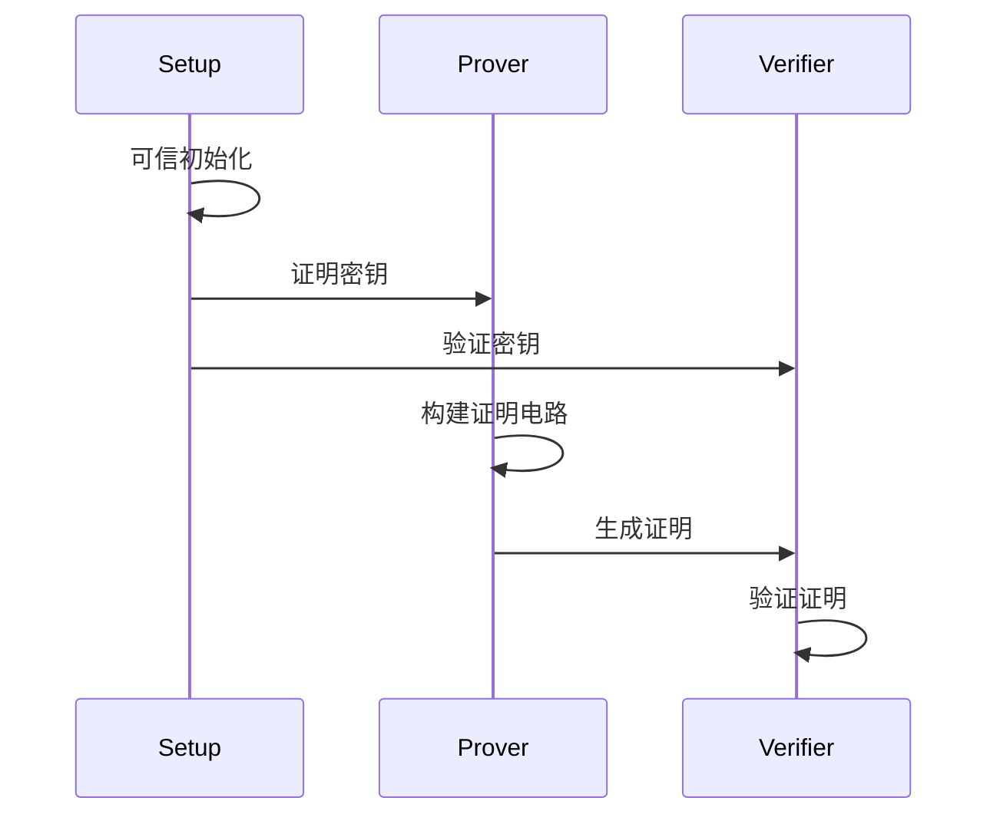

# 1. Zero-Knowledge Proofs
## 1.1 zk 核心要素
- 完整性 Completeness
- 可靠性 Soundness
- 零知识 Zero-Knowledge
## 1.2 主要类型
- 交互式 Interactive
- [非交互式 Non-Interactive](./other/非交互式.md)
## 1.3 技术分类
- [zk-SNARK协议](./14.zk-SNARK协议.md)
  - [Groth16](./15.Grot16.md)
  - [Plonk](./18.Plonk.md)
- [zk-STARK](./19.zk-STARK.md)
- Bulletproofs
## 1.6 一些名词解释
- [零知识](./13.零知识证明协议.md)
- [证明](./other/证明.md)
- [见证](./other/witness.md)
- [非交互式](./other/非交互式.md)
# 2. 工作原理

# 3. 安全问题
## 3.1  [离散对数（和ECC一样）](./basicMath/2.离散对数问题.md)
基本形式：
- 证明者知道 x，使得 ```y = g^x```
- 但不泄露 x 的值
## 3.2 椭圆曲线配对（Pairing）(bls)
特点：
- e(P, Q) 是双线性的
- 用于构建更复杂的证明系统
- 比如 SNARKs 中的配对友好曲线
## 3.3 多项式承诺（Polynomial Commitments）
用途：
- [KZG多项式承诺](./promise/3.kzg多项式承诺.md)
- 将计算问题转化为多项式问题
- 可以证明多项式求值的正确性
## 3.4 哈希函数
应用：
- [Merkle树](./merkle/merkle.md)
- 承诺方案
- [Fiat-Shamir 变换](./other/非交互式.md)