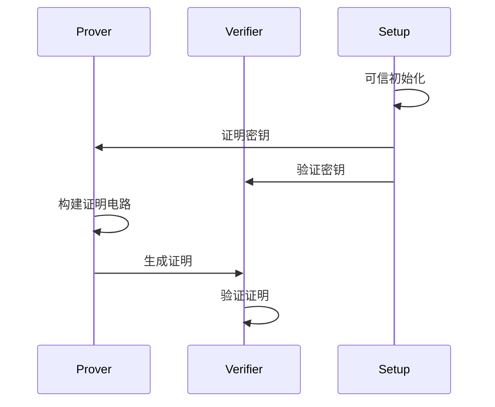

# 1. Zero-Knowledge Proofs
## 1.1 zk 核心要素
- 完整性 Completeness
- 可靠性 Soundness
- 零知识 Zero-Knowledge
## 1.2 主要类型
- 交互式 Interactive
- 非交互式 Non-Interactive
## 1.3 技术分类
- zk-SNARKs
  - Groth-16
  - Plonk
- zk-STARKs
- Bulletproofs
# 2. 工作原理
