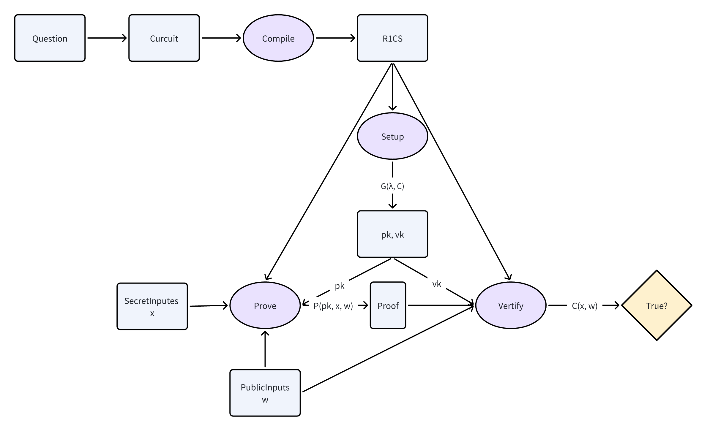

# zk-SNARK 的定义
ZK-SNARK（Zero-Knowledge Succinct Non-Interactive Argument of Knowledge）
- Zero-Knowledge代表“零知识”。
- Succinct代表“简洁”，指的是证明规模最多只有⼏百字节，故证明可
以在⼏毫秒内得到验证。
- Non-Interactive代表“⾮交互”，指的是从证明者到验证者只存在单⼀
信息。
- Arguments是指计算具备可靠性，即有限计算能⼒的证明者不能伪造
证明，⽆限计算能⼒的证明者可以伪造证明。
- Knowledge指的是证明者在不知道有效信息的情况下⽆法构造出参数
和证明。
 

- ZK-SNARK证明依赖证明者和验证者之间的初始可信设
置，需要⼀组公共参数来构造零知识证明，从⽽开展私有交易。

# zk-SNARK 的工作原理
`zk-SNARK` 由三种算法 `G`, `P`, `V` 组成，分别定义如下：
1. 算法 `G`，表示 `Key Generator`。
- 它接受秘密参数 `lambda` 和程序 `C`，
- 并生成两个公开可用的密钥：证明密钥 `pk` 和验证密钥 `vk`。可表示为 `(pk, vk) ← G(λ, C)`。
- 生成的这两个密钥是公开参数，且对于指定的程序 C 来说只需要生成一次。
2. 算法 `P` 是 `prover` 执行的算法。
- 它有三个输入：证明密钥 `pk`、公开输入 `x` 和秘密输入 `w`。
- 运行该算法会得到一个证明，即 `prf ← P(pk, x, w)`。
3. 算法 `V` 是 `verifier` 执行的算法。
- 它有三个输入：验证密钥 `vk`、公开输入 `x` 和算法 P 输出值 `prf。如果` 
- `prf` 是正确的，则 `V(vk, x, prf)` 返回 true，否则返回 false。
- 也就是说，如果 `prover` 确实知道某个 `w` 会满足 `C(x, w) = true`，且 prover 正确地计算了 prf，那么 `V(vk, x, prf)` 就会为 true。

# 示例程序的 zk-SNARK 解决方案
Alice 和 Bob 如何使用 zk-SNARK 来让 Alice 证明她知道的秘密值
1. 初始化阶段（`Setup`）
- Bob 作为验证者，首先运行密钥生成算法 `G`
- **输入**：随机生成的安全参数 `λ (lambda)` 和程序 `C`
- **输出**：生成一对密钥 (`pk`, `vk`)
- `(pk, vk) ← G(λ, C)`
- Bob 将 `pk`（证明密钥）和 `vk`（验证密钥）分享给 Alice
- 注意：`λ` 必须保密，不能泄露给 Alice
2. 证明阶段（`Prove`）
- Alice 作为证明者（`prover`），使用算法 `P` 生成证明
- **输入**：
  - `pk`：证明密钥
  - `x`：公开输入（如哈希值 H）
  - `w`：私密输入（如秘密值 s）
- **输出**：生成证明 `prf`
- `prf ← P(pk, x, w)`
3. 验证阶段（`Verify`）
- Bob 作为验证者（`verifier`），使用算法 `V` 验证证明
- 输入：
  - `vk`：验证密钥
  - `x`：公开输入
  - `prf`：Alice 生成的证明
- 输出：`true/false`
- `V(vk, x, prf) → {true, false}`
 

关键特点：
- 整个过程中，Alice 无需向 Bob 透露私密输入 `w`
- 验证过程是非交互式的
- 对于同一个程序 `C`，密钥对只需要生成一次
- 如果 Alice 确实知道满足条件的私密输入 `w`，那么验证一定会通过
- 如果 Alice 不知道有效的 `w`，她将无法生成有效的证明

## 1. zkSNARK
计算转换链：
- 普通计算 
→ R1CS约束 
→ 向量关系 
→ 矩阵关系 
→ 多项式关系 
→ QAP

证明转换链：
- 计算证明 
→ R1CS证明 
→ QAP证明 
→ 零知识证明

## 2. Groth16
计算转换链：
- 普通计算 
→ R1CS约束 
→ QAP 
→ 配对友好多项式

证明转换链：
- 计算证明 
→ 多项式承诺 
→ 配对验证 
→ 零知识证明

## 3. PLONK
计算转换链：
- 普通计算 
→ 算术化 
→ PLONKish约束 
→ 置换参数多项式 
→ 多项式承诺

证明转换链：
- 计算证明 
→ 置换证明 
→ 多项式承诺证明 
→ 零知识证明

## 4. 对比
| 特性 | zkSNARK | Groth16 | PLONK |
|------|----------|----------|--------|
| 约束系统 | R1CS | R1CS | PLONKish约束 |
| 多项式系统 | QAP | 优化的QAP | 置换多项式 |
| 可信设置 | 电路相关 | 电路相关 | 通用SRS |
| 证明大小 | 较大 | 最小 | 中等 |
| 验证时间 | 较快 | 最快 | 中等 |
| 设置灵活性 | 低 | 低 | 高 |
| 电路修改 | 需重新设置 | 需重新设置 | 无需重新设置 |
| 实现复杂度 | 中等 | 较简单 | 较复杂 |

# zk-snark 的待优化点
- 都⾯临对算⼒要求⾼、计算时间⻓等瓶颈，因为产⽣多项式承诺的过程需要⼤数点（Multi￾Scalar Multiplication，MSM）
- 待证明电路的规模也是硬件优化的对象之⼀。
