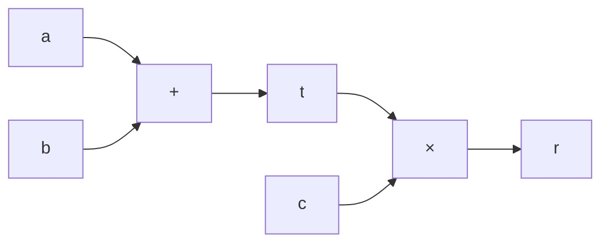

# 1. 通用门方程
Plonk 使用一个通用的方程来表达所有类型的门:
```QL⋅a + QR⋅b + QO⋅c + QM⋅(a⋅b) + QC = 0```
- a, b 是输入信号
- c 是输出信号
- QL, QR, QO, QM, QC 是系数
  - QL     // a 的系数
  - QR     // b 的系数
  - QO    // c 的系数
  - QM     // 乘法项
  - QC     // 常数项
# 2. 加法门
我们想表达: ```a + b = c```
转换为: ```a + b - c = 0```
- QL = 1    // a 的系数
- QR = 1    // b 的系数
- QO = -1   // c 的系数
- QM = 0    // 不需要乘法项
- QC = 0    // 不需要常数项
<br/>
代入通用方程:
```1⋅a + 1⋅b + (-1)⋅c + 0⋅(a⋅b) + 0 = 0```
简化为:
```a + b - c = 0```

# 3. 乘法门
我们想表达: ```a * b = c```
转换为: ```a * b - c = 0```
- QL = 1    // a 的系数
- QR = 1    // b 的系数
- QO = -1   // c 的系数
- QM = 1    // 需要乘法项
- QC = 0    // 不需要常数项
<br/>
代入通用方程:

``` 0⋅a + 0⋅b + (-1)⋅c + 1⋅(a⋅b) + 0 = 0 ```

简化为:

```a ⋅ b - c = 0```
# 4. 常量门
我们想表达: a = k
转换为: ```a - k = 0```

- QL = 1    // a 的系数
- QR = 0    // 不需要 b 项
- QO = 0    // 不需要 c 项
- QM = 0    // 不需要乘法项
- QC = -k   // 常数项为 -k

<br/>
代入通用方程:

``` 1⋅a + 0⋅b + 0⋅c + 0⋅(a⋅b) + (-k) = 0 ```
简化为:
```a - k = 0```

# 5. 复合运算
计算 `(a + b) × c` 可以分解为：
1. `t = a + b` (加法门)
2. `r = t × c` (乘法门)



第一步（加法门）：
```
1⋅a + 1⋅b + (-1)⋅t + 0⋅(a⋅b) + 0 = 0
```

第二步（乘法门）：
```
0⋅t + 0⋅c + (-1)⋅r + 1⋅(t⋅c) + 0 = 0
```


# 6. 实例演示
```
# 例如计算: (5 + 3) * 2 = 16

# 1. 常量门: 设置输入 5
a₁ = 5
QL = 1, QR = 0, QO = 0, QM = 0, QC = -5
验证: 1⋅5 + 0⋅b + 0⋅c + 0⋅(5⋅b) + (-5) = 0 ✓

# 2. 常量门: 设置输入 3
a₂ = 3
QL = 1, QR = 0, QO = 0, QM = 0, QC = -3
验证: 1⋅3 + 0⋅b + 0⋅c + 0⋅(3⋅b) + (-3) = 0 ✓

# 3. 加法门: 5 + 3 = 8
a₃ = 5, b₃ = 3, c₃ = 8
QL = 1, QR = 1, QO = -1, QM = 0, QC = 0
验证: 1⋅5 + 1⋅3 + (-1)⋅8 + 0⋅(5⋅3) + 0 = 0 ✓

# 4. 常量门: 设置输入 2
a₄ = 2
QL = 1, QR = 0, QO = 0, QM = 0, QC = -2
验证: 1⋅2 + 0⋅b + 0⋅c + 0⋅(2⋅b) + (-2) = 0 ✓

# 5. 乘法门: 8 * 2 = 16
a₅ = 8, b₅ = 2, c₅ = 16
QL = 0, QR = 0, QO = -1, QM = 1, QC = 0
验证: 0⋅8 + 0⋅2 + (-1)⋅16 + 1⋅(8⋅2) + 0 = 0 ✓
```

# 7. 问题
## 1. 通用方程的来源