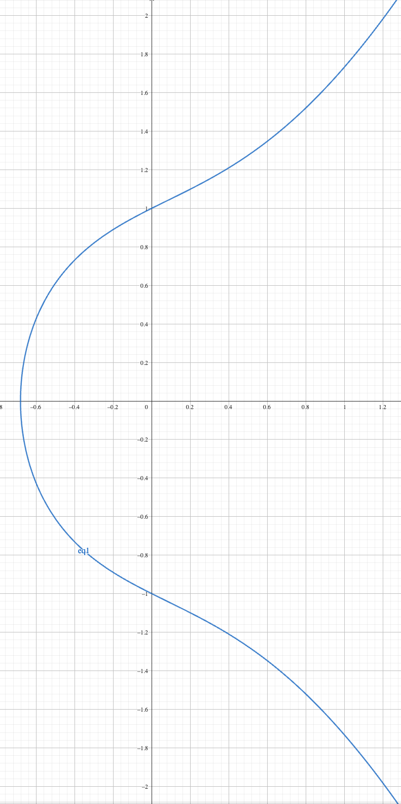
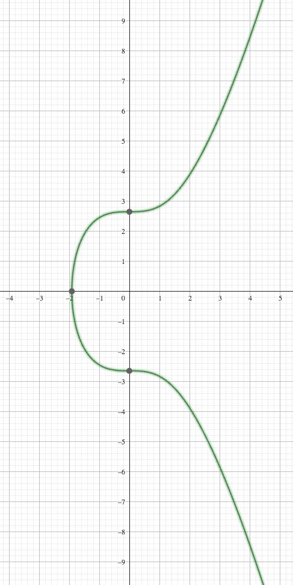
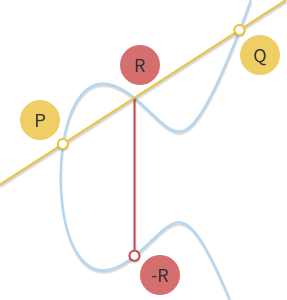

# 1. 椭圆曲线
https://www.geogebra.org/calculator
<br/>

```y² = x³ + ax + b```
- 当 a = 1, b = 1
<br/>

- ECDSA (secp256k1): 当 a = 0, b = 7
<br/>


- RSA 是基于```因数分解```问题 保障安全的
- ECC 是基于```离散对数```问题 保障安全的

# 2. 补充一下
## 1. 阶数
- 椭圆曲线的阶数 就是群组的个数
## 2. mod（模运算）
- 简单理解为 椭圆曲线的 ```mod 计算```是为了保障 结果在群
- 比如阶数为3  mod 3 的结果 就是 0 1 2

# 4. 几何加法
假设我们要把两个点 P 和 Q 相加：
- 画一条直线穿过 P 和 Q
- 这条线会在曲线上切到第三个点（称为 R'）
- R' 关于 x 轴的对称点就是 P+Q 的结果


# 

# 简单应用
## 1. 标量 (Scalar)
- 标量就是一个普通的数字
- 可以进行普通的数学运算
- 在 EdDSA 中通常是模 L 的值（L 是曲线阶数）
## 2. 点（point）
- 点是曲线上的一个坐标，由 (x,y) 组成
- 不能直接进行普通的数学运算

## 3. 点加法
- P₁ = (x₁, y₁)
- P₂ = (x₂, y₂)
- P₁ + P₂ = (x₃, y₃)

```
在曲线 y² = x³ + 7 上：(spc256k1)
假设：
P₁ = (2, 5)
P₂ = (3, 7)

1. 计算斜率：
λ = (7 - 5)/(3 - 2) = 2

2. 计算 x₃：
x₃ = 2² - 2 - 3 = -1

3. 计算 y₃：
y₃ = 2(2 - (-1)) - 5 = 6 - 5 = 1

所以 P₃ = (-1, 1)
```
## 4. 标量乘法
- 标量 * 点 = 新的点
- 3 * B = B + B + B = (x₅, y₅)
- 公钥 = 私钥 （一个大随机数） * 基点 G