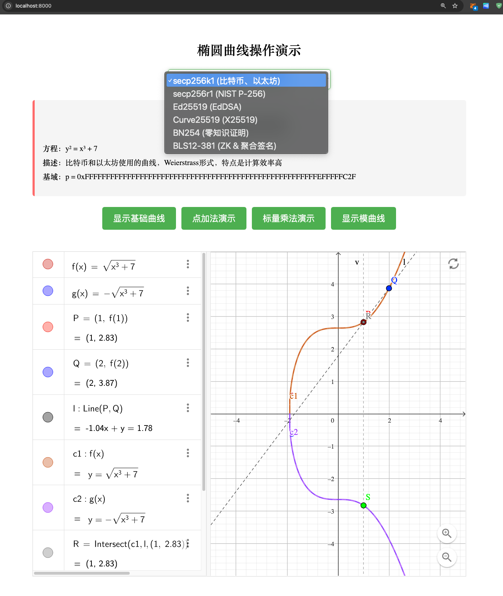

# zk-study
从零开始学zk和密码学,入门教程，不追求数学推导  
追求工程理解，代码层面用 go 实现，后续补充 ts 代码  
https://github.com/CJ-Labs/cryptography-go
## 学习清单
- [🪜] [认识Zero-Knowledge](./1.认识zk.md)
- [🪜] [零知识证明科普入门](零知识证明科普.md)
- [✅] 基础数学
  - [✅] [群&有限域](./basicMath/1.群&有限域.md)
  - [✅] [离散对数](./basicMath/2.离散对数问题.md)
  - [✅] [同态加密](./basicMath/3.同态加密.md)
- [ 🪜 ] 椭圆曲线
  - [✅] [椭圆曲线](./ecc/1.椭圆曲线.md)
  - [🪜] [ECDSA算法](./ecc/2.ECDSA算法.md)
  - [🪜] [以太坊中的ECDSA算法](./ecc/2.1.以太坊中的ECDSA算法.md)
  - [🪜] [EdDSA算法](./ecc/3.EdDSA算法.md)
  - [✅] [BN254曲线](./ecc/4.BN254曲线.md)
  - [✅] [BLS算法](./ecc/5.BLS算法.md)
  - [✅] [schnor](./ecc/6.shcnor.md)
- [ ] 数据结构
  - [✅ ] [Merkle树](./merkle/merkle.md)
- [ ] 线性代数
  - [ ] [向量](.linearAlgebra/1.向量.md)
  - [ ] [矩阵](.linearAlgebra/2.矩阵.md)
- [ ] 承诺 和多项式系统
  - [✅] [承诺基础](./promise/1.承诺.md)
  - [✅] [Pedersen承诺](./promise/2.Pedersen承诺.md)
  - [✅] [KZG多项式承诺](./promise/3.kzg多项式承诺.md) Plonk用到
  - [🪜] [Poseidon哈希函数](./promise/4.Poseidon哈希函数.md)
  - [🪜] [FRI承诺](./promise/5.FRI承诺.md) `ZK-STARK` 和 `Plonky2` 用到
  - [🪜] [IPA承诺](./promise/6.IPA承诺.md) Halo2 用到
- [ ] zk 中的名次解释
  - [✅] [证明](./other/证明.md)
  - [✅] [见证](./other/witness.md)
  - [✅] [非交互式](./other/非交互式.md) 常见的非交互式 包含 `Fiat-Shamir` 和 `CRS (Common Reference String)`
  - [🪜] [CRS (Common Reference String)](./other/CRS.md)
- [✅] 电路系统
    程序逻辑 → 门电路 → 算术电路 → R1CS → QAP → 零知识证明
  - [✅] [门电路](./circuit/1.门电路.md)
  - [✅] [算术电路](./circuit/算术电路.md)
  - [✅] [约束系统](./circuit/2.约束系统.md)
  - [✅] [R1CS](./circuit/3.R1CS.md)
  - [✅] [QAP](./circuit/4.QAP.md)
  - [✅] [门约束](./circuit/5.门约束.md)  Plonk用到
  - [✅] [线约束](./circuit/6.线约束.md)  Plonk用到
- [ ] 证明系统
  - [ ] [Sigma协议](./sigma协议.md)
  - [✅] [零知识证明协议](./13.零知识证明协议.md)
  - [🪜] [zk-SNARK协议](./14.zk-SNARK协议.md)
  - [✅] [Groth16](./15.Grot16.md)
  - [🪜] [Plonk](./18.Plonk.md)
  - [ ] [Plonky2]()  [Plonk](./18.Plonk.md) + [FRI承诺](./promise/5.FRI承诺.md)
  - [ ]  [Plonky3]() Plonky2 的改进版，官网没更新完
  - [🪜] [zk-STARK](./19.zk-STARK.md)
  - [🪜]  [Bulletproofs 范围证明](./Bulletproofs.md)
- [ ] zk Rollup 项目
  - [] [poloygon-zkevm]()
  - [] [scroll]

- [] zkp 跨链项目
- [ ] 参考实战项目 [ZKMerkle Proof of Solvency](https://github.com/leo-shi-dacheng/zkmerkle-proof-of-solvency)
  - [✅] [ZKMerkle Proof of Solvency 项目解析](./zkmerkle-proof-of-solvency/1.项目解析.md)
  - [✅] [如何编写电路](./zkmerkle-proof-of-solvency/如何编写电路.md)
 
教程感觉越写越多。用爱发电有点累  
准备搞一些动画方便理解！！！！
