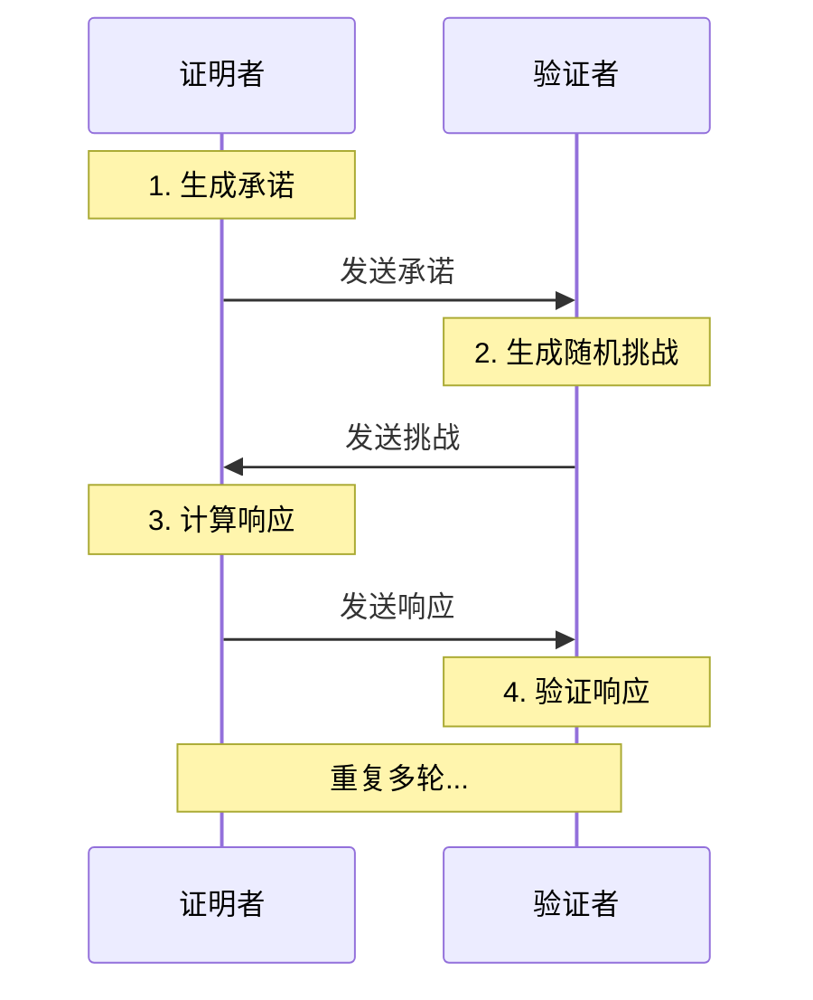
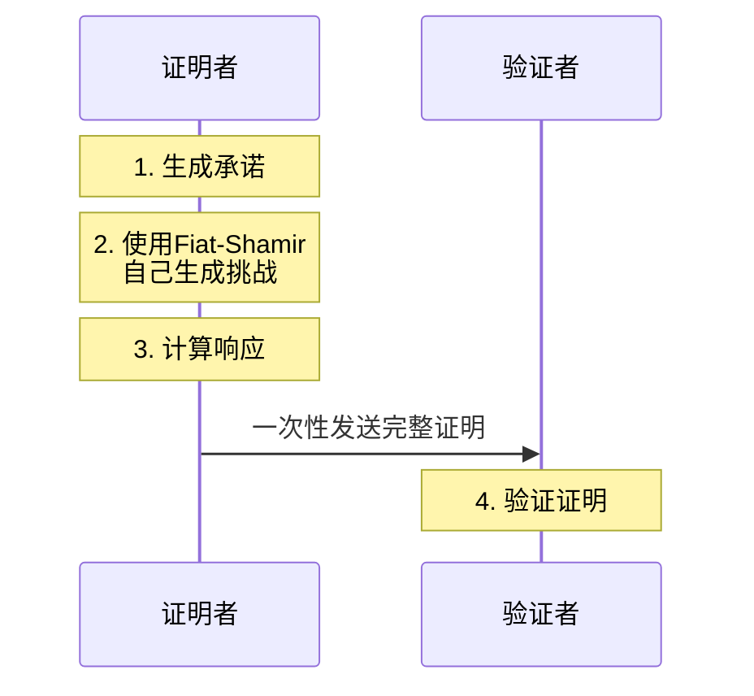

# 证明
1. 什么叫证明
从 `归纳推理` -> `演绎推理` -> `计算机证明` -> `交互式证明` -> `非交互式证明`

## 交互式证明
通过构造两个图灵机进行 `交互` 而不是`推理`，证明一个命题在概念上是否成立

### 交互式证明步骤

- 证明者和验证者必须同时在线

### 非交互式证明的改进

常见的可以通过 `Fiat-Shamir ` 将 交互式证明 转换为 非交互式证明
[非交互式](./非交互式.md)

## issue
交互式证明和非交互式证明一定需要见证吗? 为什么？