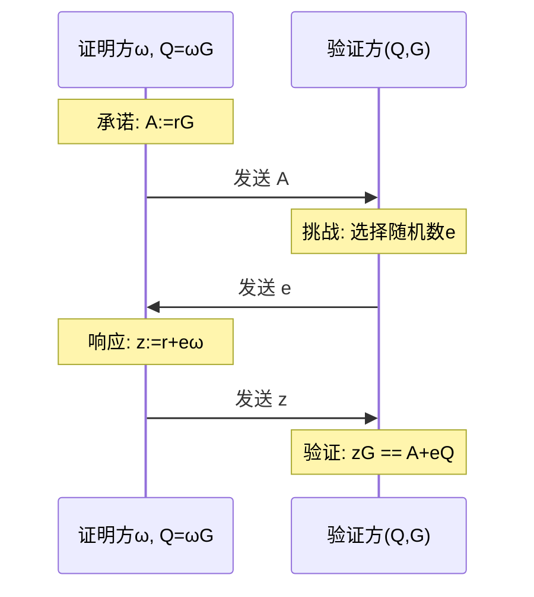

# 1. 承诺
1. 承诺 
  - 1. 发送方将某个值x 封装为y发送给接收方
  - 2. 发送方不能修改信封中的值（绑定性）
  - 3. 接收方无法知道x（隐藏性）
2. 打开承诺 
  1. 发送方揭露x
3. 验证承诺
接收方校验打开的值x和y 中封装的x是否相同
# 2. Hash 承诺
- 承诺:发送哈希值y
- 打开承诺:发送原象x
- 校验承诺:校验哈希一致性
# 3. Merkle 承诺与 Merkle 证明
1. 承诺
  1. 发送root
2. 打开承诺
  1. 发送叶子结点 ```Xi 和 pathi ， i= 1, .....20```
3. 校验承诺
校验 ```root == Makle(xi, pathi), i = 1,....20```
```go
 type MerkleCommitment struct {
    root     []byte
    leaves   [][]byte
    paths    [][]byte
}

func (m *MerkleCommitment) Commit(data [][]byte) []byte {
    // 1. 计算所有叶子节点的哈希
    // 2. 构建 Merkle 树
    // 3. 返回 root
    return root
}

func (m *MerkleCommitment) Open(index int) ([]byte, []byte) {
    // 返回叶子节点和证明路径
    return leaf, path
}

func (m *MerkleCommitment) Verify(root, leaf, path []byte) bool {
    // 验证 Merkle 路径
    return computedRoot == root
}
```
***
# 4. Sigma 零知识证明中的承诺
## 4.1 基本概念
- ω: 证明方的私密值（要证明知道但不泄露的值）
- G: 群的生成元（公开参数）
- Q = ω·G: 公钥/公开值（相当于私密值的公开承诺）
- r: 随机数（用于随机化，保护私密值）
## 4.2 协议步骤

1. 承诺阶段
  <p>证明方：</p>

  - 选择随机数 `r`
  - 计算承诺 `A = r·G`
  - 发送 `A` 给验证方
  <p>目的：随机化证明过程，防止泄露私密值 `ω`</p>
2. 挑战阶段
  <p>验证方：</p>

  - 选择随机数 e
  - 发送 e 给证明方
  <p>目的：引入随机性，防止证明方作弊</p>
3. 响应阶段
  <p>证明方：</p>

  - 计算响应 z = r + e·ω
  - 发送 z 给验证方
  <p>目的：将随机数 r 和私密值 ω 结合</p>
4. 验证阶段
  <p>验证方检查等式：<p>

  - `z·G ?= A + e·Q`
  <p>原理：</p>
  
  - 左边：z·G = (r + e·ω)·G
  - 右边：A + e·Q = r·G + e·(ω·G)
  - 两边展开后相等
## 4.3 为什么是零知识的
1. 随机化
  - r 是随机选择的
  - z 包含 r，所以每次证明都不同
  - 验证方无法从 z 中提取出 ω
2. 信息隐藏
  - A 是随机化的承诺
  - z 混合了随机数 r 和私密值 ω
  - 验证方只能验证关系，无法获取私密值
## 4.4 安全性分析
1. 完整性
诚实的证明方总能通过验证：
- ```z·G = (r + e·ω)·G = r·G + e·ω·G = A + e·Q```
2. 可靠性
  如果不知道 ω，难以构造有效的 z：
  - 需要同时满足承诺 A 和响应 z
  - e 是随机选择的，无法提前准备
3. 零知识性
## 4.5 实际应用示例
```go
package main

import (
  "math/big"

  "github.com/consensys/gnark-crypto/ecc/bn254"
  "github.com/consensys/gnark-crypto/ecc/bn254/fr"
)

// SigmaProtocol 实现零知识证明协议
type SigmaProtocol struct {
  G *bn254.G1Affine
}

// Prover 证明者结构体
type Prover struct {
  privateKey *fr.Element     // 是要证明知道但不泄露的私钥
  publicKey  *bn254.G1Affine // 是对应的公钥 Q = privateKey * G
  r          *fr.Element     // 随机数
  A          *bn254.G1Affine // 承诺值 A = r * G + Q
}

// 创建新的证明者
func NewProver(privateKey *fr.Element) *Prover {
  // 计算公钥
  var publickey bn254.G1Affine
  publickey.ScalarMultiplication(&bn254.G1Affine{}, privateKey.BigInt(new(big.Int)))

  return &Prover{
    privateKey: privateKey,
    publicKey:  &publickey,
  }
}

// Commit 承诺阶段
func (p *Prover) Commit() *bn254.G1Affine {
  // 生成随机数 r
  p.r, _ = new(fr.Element).SetRandom()

  // 计算承诺值 A = r * G
  var A bn254.G1Affine

  A.ScalarMultiplication(&bn254.G1Affine{}, p.r.BigInt(new(big.Int)))

  p.A = &A
  return p.A
}

// Response 响应阶段
func (p *Prover) Response(challenge *fr.Element) *fr.Element {
  // 计算响应值  z = r + e * privateKey
  z := new(fr.Element).Mul(challenge, p.privateKey)
  z.Add(z, p.r)
  return z
}

// Vertifier 验证者结构体
type Vertifier struct{}

// Challenge 生成随机挑战 随机数 e
func (v *Vertifier) Challenge() *fr.Element {
  challenge, _ := new(fr.Element).SetRandom()
  return challenge
}

// Verify 验证阶段
func (v *Vertifier) Verify(
  publicKey *bn254.G1Affine, // Q 公钥
  A *bn254.G1Affine, // 承诺值 A
  challenge *fr.Element, // 随机数 e
  response *fr.Element, // 响应值 z
) bool {
  // 验证 z * G == A + e * Q
  var left, right bn254.G1Affine
  // 计算左边
  left.ScalarMultiplication(&bn254.G1Affine{}, response.BigInt(new(big.Int)))
  // 计算右边 A + e * Q
  right.ScalarMultiplication(publicKey, challenge.BigInt(new(big.Int)))
  right.Add(&right, A)

  return left.Equal(&right)
}

func main() {
  // 1. 初始化
  privateKey, _ := new(fr.Element).SetRandom()
  prover := NewProver(privateKey)
  vertifier := &Vertifier{}

  // 2. 承诺阶段
  A := prover.Commit()

  // 3. 挑战
  challenge := vertifier.Challenge()
  // 4. 响应
  response := prover.Response(challenge)
  // 5. 验证
  isValid := vertifier.Verify(prover.publicKey, A, challenge, response)

  // 验证结果
  if isValid {
    println("验证通过!")
  } else {
    println("验证失败!")
  }
}
```