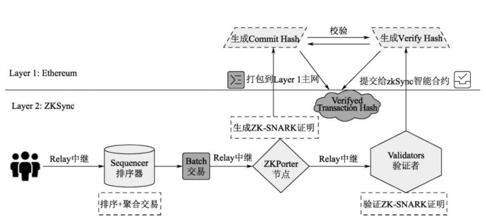

zkSync在⼯作流程中主要包含了Relay（中继）、Sequencer（排序
器）、ZKPorter节点、Validator（验证者）4个⻆⾊，其运⾏步骤如下：
- User通过Relay向Sequencer发送批量交易。
- Sequencer负责对交易排序、聚合打包批处理成Merkle树。
- ZKPorter将Merkle树⽣成ZK-SNARK证明。
- ZK-SNARK证明分别中继给Layer 2的Validators和Layer 1主链⽣成
承诺哈希（Commit Hash）。
- Validator负责验证ZK-SNARK证明的正确性，⽆误后提交给Layer 1
智能合约⽣成确认哈希（Verify Hash）。
- Layer 1上的zkSync智能合约校验Commit Hash和Verify Hash是否匹
配。
- 在匹配成功后，⽣成“已确认交易”并最终上链。若匹配失败，原来的
Commit Hash作废，由Sequencer重新提交批处理，再按照流程进⾏
验证。

 

zkSync Era使⽤的本地账户抽象还有以下特性：
- ⽆助记词。助记词容易丢失或被⿊客窃取。zkSync Era账户抽象可通
过家⼈、朋友或选定的第三⽅实现⽣物识别验证和社交恢复，⽤户可
以⽤他们的Web 2登录信息访问以太坊，并设置单个应⽤程序级别的
⾃定义权限。
- 可以⽤任何代币⽀付费⽤。在zkSync Era上，为其他账户补贴Gas费
⽤的账户被称为Paymasters，Paymasters能在后端将所选代币换成
ETH，从⽽zkSync Era上的账户就可以通过Paymasters⽤任何代币⽀
付Gas费⽤，甚⾄在愿意补贴Gas费⽤的协议上可以以零费⽤进⾏交
易。
- 可以批处理。以前⽤户必须⼿动批准每个合约并⼿动执⾏交易，执⾏
操作不仅复杂⽽且会增加Gas费⽤。由于Layer 1只有⼀个状态变化，
zkSync Era账户抽象可以对操作进⾏批处理并⼀次批准所有操作，使
得⽤户与DApp的交互更便宜、更快。
- 可以预设单次签名时间，设定交易价值阈值，同时可在参数范围内进
⾏任意次数的交互。
- ⾃动付款。zkSync Era让加密货币⾃动⽀付不再依赖交易所或第三⽅
⾮托管账户，⽤户可以在⾃我托管的条件下创建⾃动转账并预定转
账、定期⽀付订阅等任务

 
zkSync Era属于类型4的zkEVM。zkSync Era将Solidity中的合约代码
翻译为⼀种叫作Yul的中间语⾔，通过LLVM编译器，可以将来⾃前端
的⼈类可读代码“翻译”成zkEVM操作码，并在其⾃定义的环境中执
⾏。

# PLONK协议的优化
zkSync使⽤的是PLONK协议，该协议通⽤，其可信设置可更新，有更
⼩规模的证明。