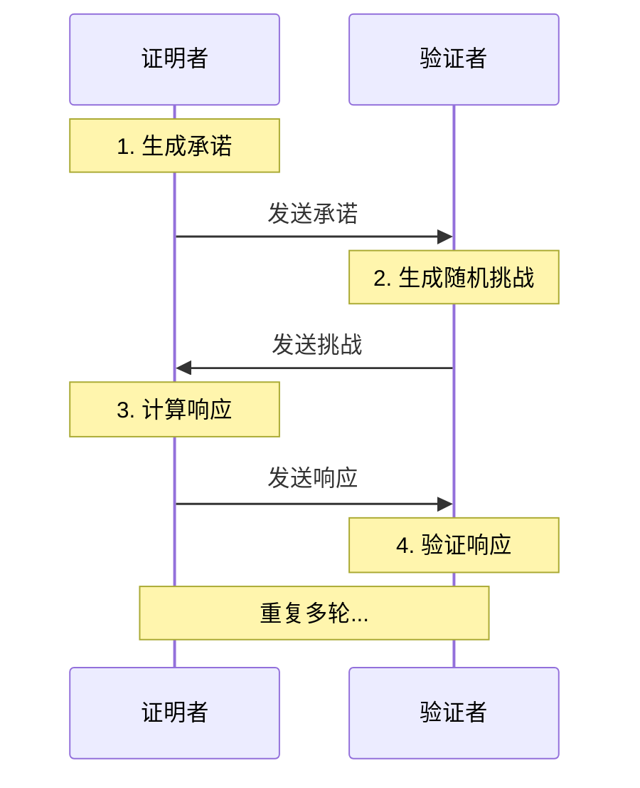
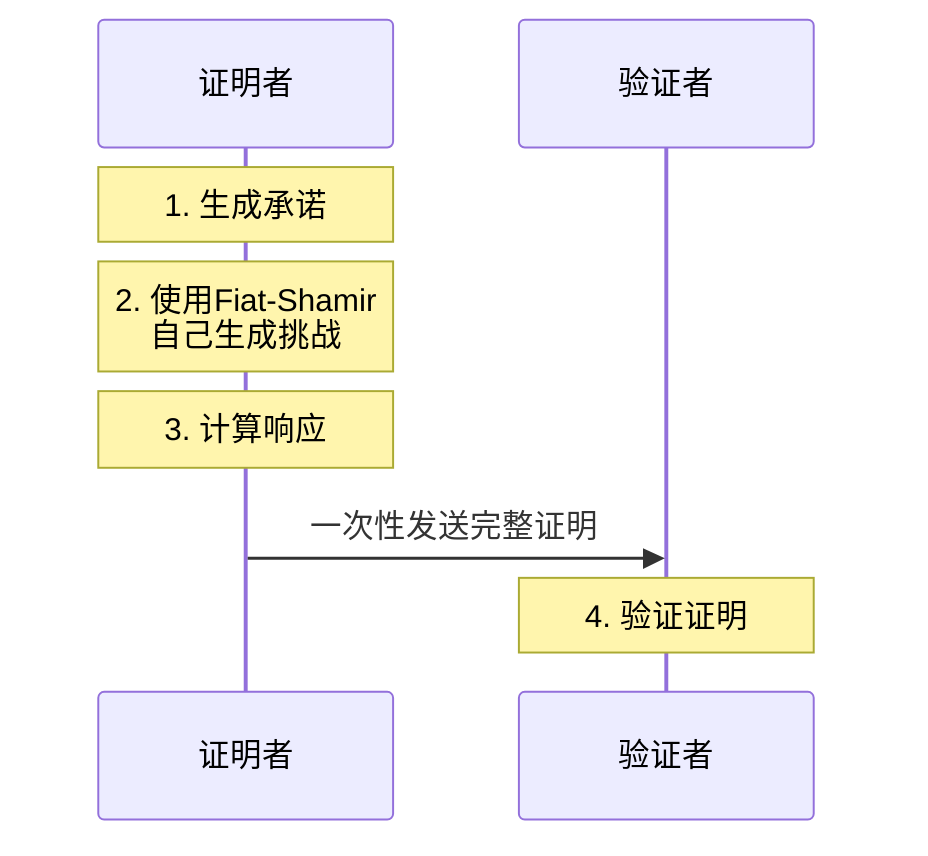
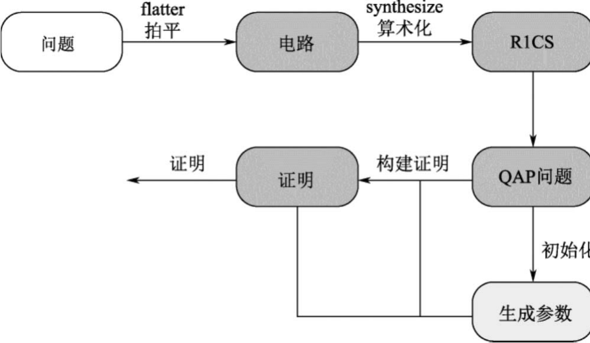

# Layer2扩容方案
- - State Chanel
    - 闪电网络
- Sidechain
  - Polygon PoS Chain
  - BSC (Binance Smart Chain)
- Sharding
  - Near Protocol
- Rollup （重点）
  - ZK Rollup：定期同步State Root及其Validity Proof（ZK证明）到Layer1，Layer1用合约验证Proof保证SV
  - Optimistic Rollup：定期同步State Root到Layer1，Layer1通过Fraud Proof保证SV

 

[l2beat](https://l2beat.com/scaling/summary)

｜ 当然 ZK Rollup 知识 zk 应用的一部分
- zk 还有很多其他的应用 隐私计算，跨链桥 payfi defi 等方面都有应用

# ZK 基础 （Zero-Knowledge）
今天重点是科普一下 `零知识证明`

## 1. 零知识
## 2. 证明
人们期望通过`证明`接近真实或真理
从 `归纳推理` -> `演绎推理` -> `计算机证明` -> `交互式证明` -> `非交互式证明`

### 2.1 归纳推理
- 通过观察多个具体例子，总结出一般规律
- 从特殊到一般的思维过程

### 2.2 演绎推理
- 从已知的普遍原理，推导出具体结论
- 从一般到特殊的思维过程

### 2.3 计算机证明
简单理解：
- 用数学和逻辑方式，让计算机验证某个结论
- 通过严格的数学运算来证明命题

例子：
- 输入：一个数学问题
- 计算：通过程序进行逻辑运算
- 输出：给出证明或反例

### 2.4 交互式证明
通过构造两个`图灵机`进行 `交互` 而不是`推理`，证明一个命题在概念上是否成立

####  交互式证明举例
#####  场景
两个完全相同的球，只是颜色不同:
- 一个红球
- 一个绿球
- 对色盲的人来说看起来一样
 

- Alice说 `"我能分辨这两个球的颜色不同"`
- Bob 是个色盲
##### 2. 证明过程
1. Bob(色盲)拿着两个球
2. Bob把球背在身后
3. Bob可能交换球的位置，也可能不换
4. 再拿出来给Alice看
5. Alice说球有没有被交换过

---------------
- 零： Alice 没有泄露知识。
- 知识：这里就是指的就是 `Bob 依然没有分辨红绿球的知识`
- 证明：证明了 Alice 能分辨颜色

####  交互式证明步骤

- 证明者和验证者必须同时在线

#### 零知识证明的三个特性
- 完备性 (Completeness)： 诚实的证明者一定能说服诚实的验证者
  - 如果Alice真能分辨颜色
  - 那她每次都能正确说出球有没有被交换
  - 成功率100%
- 可靠性 (Soundness)： 作弊的证明者几乎不可能骗过诚实的验证者
  - 如果Alice看不出颜色只是在猜
  - 一次猜对概率是1/2
  - 猜对n次的概率是(1/2)^n
  - n=20时，作弊成功率低于百万分之一
- 零知识性 (Zero-Knowledge)
  - Bob只知道Alice能分辨颜色
  - 但不知道哪个是红球
  - 不知道哪个是绿球
  - 没有学到任何关于颜色的信息

### 2.5  非交互式证明的改进

常见的可以通过 `Fiat-Shamir ` 和 `CRS 公共参考字符串`将 交互式证明 转换为 非交互式证明   
[非交互式](./非交互式.md)

#### 零知识证明
零知识证明的目标是让验证者（`verifier`）能够说服自己，  
证明者（`prover`）确实拥有一个秘密值（称为 `witness`）， 
会满足某种关系，而无需向验证者或其他任何人透露 `witness`  

程序 `C`，它接受两个输入： `C(x, w)`。  
其中输入 `x` 是公开的输入， 
而 `w` 秘密的输入（`witness` 缩写）。 
程序 `C` 的输出是`布尔值`，即 true 或 false。 
零知识证明的目标是被给予公开输入 `x`， 
证明 prover 知道某个秘密输入 `w`， 
会满足关系 `C(x, w) == true`。 

#### 举例
假设 Bob 得到了某个值的哈希值 `H`  
并且他希望有一个证明， 
证明 Alice 知道 `s` 的哈希值就是 `H`。 
显然，Alice 直接把 `s` 值给 Bob， 
然后 Bob 计算它的哈希值并检查它是否等于`H` 即可。 

* 然而，假设Alice不想吧`s`透露给 Bob， 而只是想证明她知道 `s`。为此，Alice 可以使用 zk-SNARK

 

换句话说：程序接受一个公开的哈希值 `x` 和一个秘密值 `w`， 
如果 `w` 的 SHA-256 哈希值等于 `x` 则返回 true。
 

Alice 需要创建一个证明，以证明她知道某个值 `s`， 
会满足关系 `C(H, s) == true`，且不必透露这个 `s`。 
这就是 zk-SNARKs 所能解决的问题。

## 零知识的用处
- 数据的隐私保护
- 数据压缩
- 计算压缩与区块链扩容
  - Vitalik 采用 zkSNARK 技术能够给现有的以太坊框架带来几十倍的性能提升
  - 区块生产者不需要完整的区块链，它只需要前一个状态。这会让区块规模下降到多大呢?一个常规的 Mina 节点仅需22 KB即可存储“证明”、当前状态和某个账户余额的Merkle路径。但是，如果要生成区块，这个节点需要先前状态的全部余额的Merkle树，而Merkle树的大小取决于钱包的数量。如果Mina拥有和以太坊一样多的钱包，那么Mina区块生产者也只需要约几 GB空间
- 身份认证 zkDID

# 零知识简洁⾮交互论证系统的构造
- （1）针对问题，构建对应的电路。
- （2）根据电路⽣成R1CS。
- （3）将R1CS转化为QAP问题。
- （4）初始化QAP问题的参数。
- （5）构建信息论系统。

# 零知识技术分类
- [zk-SNARK协议](./14.zk-SNARK协议.md)
  - [Groth16](./15.Grot16.md)
  - [Plonk](./18.Plonk.md)
- [zk-STARK](./19.zk-STARK.md)
- Bulletproofs